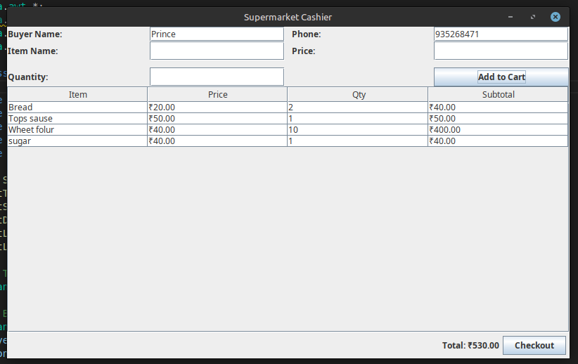
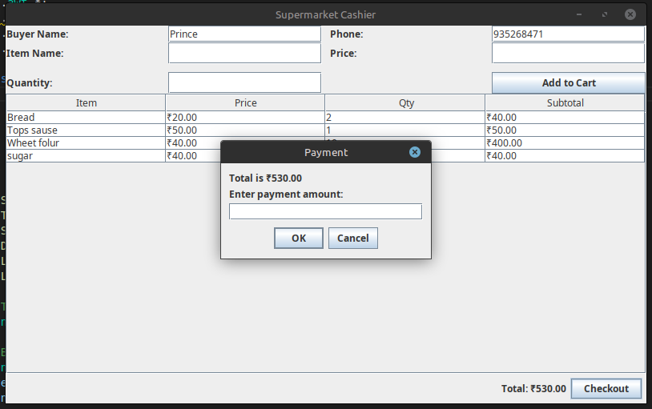
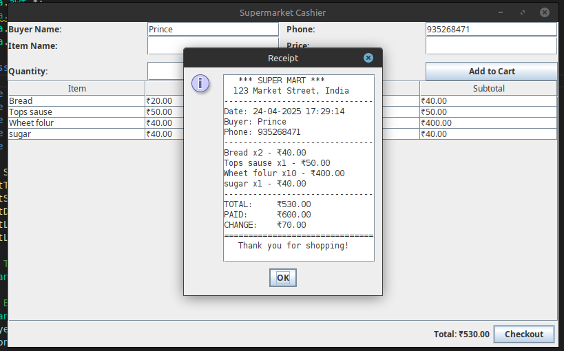
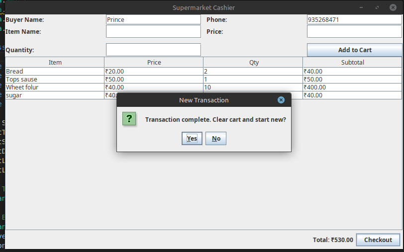

# 🛒 Supermarket Cashier - Java Swing Application

A simple yet functional Java-based desktop application designed to assist small retailers and supermarkets with billing operations. This cashier software was built using **Java Swing** for the user interface and is ideal for learning, educational, or lightweight POS systems.

---

## ✨ Features

- Add items to a cart with name, price, and quantity
- Automatically calculate subtotals and total price
- Capture buyer details (name & phone)
- Checkout with payment input and change calculation
- Generate and display a printable-style receipt
- User-friendly and responsive interface

---

## 🖼️ Screenshots

### 🧾 Main Interface - Item and Buyer Entry


### 🛍️ Items Added to Cart


### 💳 Checkout & Payment Dialog


### 📄 Receipt Generated


---

## 🚀 How to Run

1. Make sure you have **Java 8+** installed on your machine.
2. Clone the repository or download the `.java` file.
3. Compile the Java file:

   ```bash
   javac SupermarketCashier.java
